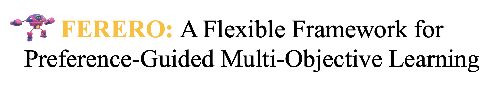

<!---
# FERERO: A Flexible Framework for Preference-Guided Multi-Objective Learning
-->
<div align="center">
    
</div>

<hr>

<div align="center">

[](https://git.io/typing-svg)

</div>


This repository contains the code for the paper's experiments: ["FERERO: A Flexible Framework for Preference-Guided Multi-Objective Learning"]().

We are continuing to update this repo.

# Introduction

# Environment setup

1. Use the following command to install the dependencies
```
conda create -n ferero python=3.8
conda activate ferero
conda install pytorch torchvision==0.9.0 torchaudio pytorch-cuda=11.7 -c pytorch -c nvidia
conda install numpy scipy seaborn tqdm
conda install -c conda-forge cvxpy
```


# Experiments

## Toy

Go to folder toy_experiments

## Multi-MNIST

Go to folder multiMNIST

## Emotion

Go to folder

## ASR

Go to folder


## License

MIT license

## Citation

```
@inproceedings{chen2024FERERO,
  title={FERERO: A Flexible Framework for Preference-Guided Multi-Objective Learning},
  author={Chen, Lisha and Saif, AFM and Shen, Yanning and Chen, Tianyi},
  booktitle={Advances in Neural Information Processing Systems},
  year={2024}
}
```


## Ackowledgement

- The toy example, multi-MNIST classification, and emotion recognition experiments use the code from [EPO](https://github.com/dbmptr/EPOSearch).
- The multi-lingual ASR experiment uses the code from [M2ASR](https://github.com/afmsaif/M2ASR) as a baseline.

We thank the authors for providing the code and data. Please cite their works and ours if you use the code or data.
